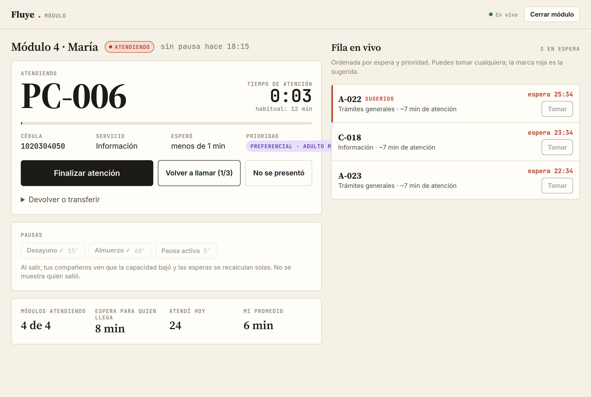
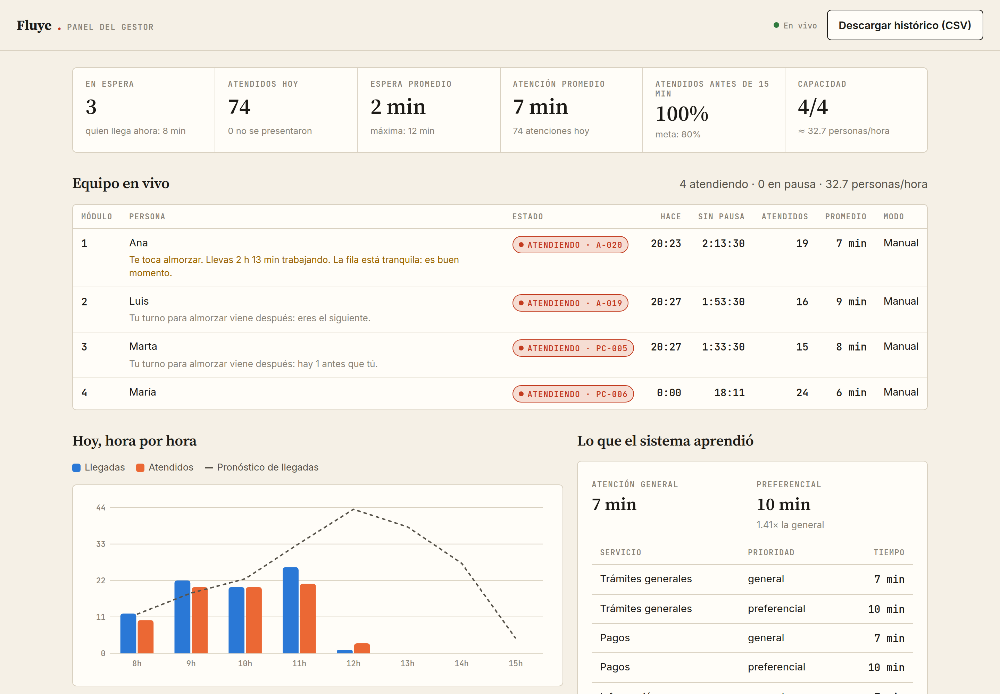
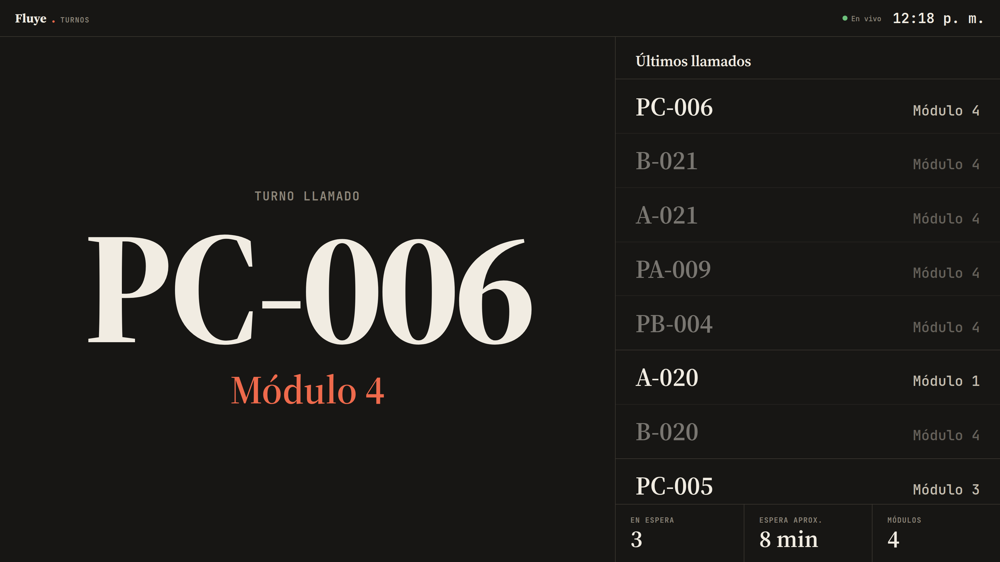
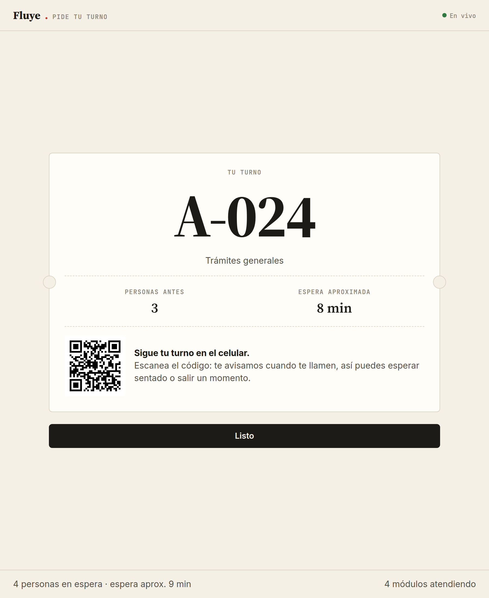

# Fluye — gestión de turnos en tiempo real

**Que la fila se mueva sola, y que el equipo también descanse.**

Fluye es un sistema de gestión de turnos para centros de atención al público. Ajusta la capacidad a los módulos que realmente están atendiendo, aprende los tiempos de atención reales y reparte las pausas del personal sin dejar la fila desatendida.

[](docs/Fluye_video.mp4)

▶️ **[Ver el video demostrativo (3 min)](docs/Fluye_video.mp4)**: el problema, la solución funcionando y los resultados.

> **Proyecto personal.** No lo implementé en la entidad donde trabajé ni lo encargó esa organización. Lo diseñé y desarrollé después, por mi cuenta, a partir de lo que observé trabajando en un centro de atención al ciudadano: cómo llegaba la gente al kiosco, cuánto esperaba y cómo se congestionaba todo a la hora del almuerzo.

## El problema

Las cifras son una estimación propia a partir de la observación diaria, no datos oficiales.

| Lo que pasaba | Consecuencia |
|---|---|
| Se entregaba un **cupo fijo de 20 turnos cada media hora** (≈40 por hora) | 4 módulos a ~8 min por persona solo atienden **≈30 por hora**: sobraban unas **10 personas cada hora** |
| La sobreventa se acumulaba toda la mañana | Hacia el mediodía había **más de 40 personas en espera** |
| No había pausas planificadas | El equipo atendía sin parar; a veces **sin tiempo ni para desayunar** |
| La espera anunciada ignoraba pausas y módulos cerrados | La gente recibía tiempos que no se cumplían |
| Las atenciones preferenciales tardan más | El sistema las trataba igual que las demás |

**Causa raíz:** todo dependía de **números fijos**: el cupo, el tiempo por persona y las pausas.

## La solución

1. **Capacidad real, en vivo.** La espera se calcula con los módulos que están atendiendo de verdad. Cuando alguien sale a almorzar, la espera que ven el kiosco, la pantalla y el celular sube en el acto.
2. **Pausas justas y con cobertura.** El sistema recomienda desayuno, almuerzo y pausas activas, y las reparte con justicia: primero quien lleva más tiempo sin parar, y nunca más de N personas fuera a la vez.
3. **Tiempos aprendidos, no adivinados.** Cada atención se cronometra desde que se toma el turno, y el sistema aprende cuánto dura cada servicio, separando a preferenciales y generales.



| Panel del gestor | Pantalla de sala | Boleto del kiosco |
|---|---|---|
|  |  |  |

## Resultados (pruebas y simulación)

- **30 pruebas automáticas** aprobadas: lógica, API y concurrencia, incluida la de dos módulos tomando el mismo turno.
- **Simulación de 20 días hábiles** con unos **3.700 turnos** y pico al mediodía.
- Cuando un módulo sale a almorzar, la espera estimada **se recalcula al instante** en todas las pantallas; en el video pasa de 9 a 13 minutos.
- El sistema **aprendió solo** que una atención preferencial tarda **entre 1,5 y 1,7 veces más** que una general.
- **Proyección:** entregar turnos según la capacidad real, unos 30 por hora en lugar de 40, eliminaría la sobreventa de unos 10 turnos por hora que generaba el atraso del mediodía.

*Aún no se ha implementado en un centro real. El siguiente paso es una prueba piloto para medir el impacto.*

## English summary

**Fluye** is a real-time queue management system for public service centers. It is a personal project, built after observing daily customer flow in a citizen service center, where a fixed ticket quota (~40/hour) exceeded real capacity (~30/hour) and created 40+ people of backlog by noon, while staff had no planned breaks.

Fluye adjusts capacity to the counters that are actually serving, learns real service times per service and priority, recommends fair staggered breaks and forecasts staffing needs per hour with Erlang C. It includes a touch kiosk, live mobile tracking via QR, an agent console with automatic assignment, a lobby display with voice calls and a manager dashboard.

**Stack:** Python, FastAPI, WebSocket, SQLite, vanilla JavaScript, pytest, Playwright, Docker. Validated with 30 automated tests and a 20-business-day simulation (~3,700 tickets).

## Autora

**María Alejandra** · [GitHub](https://github.com/malejandra7) · [LinkedIn](https://www.linkedin.com/in/maria-alejandra-a-a658aa260/)

Análisis del problema, investigación, diseño de la solución y desarrollo.

## Qué incluye

| Pantalla | Para quién | Qué hace |
|---|---|---|
| `/kiosco` | Quien llega | Tres pasos táctiles: servicio, tipo de atención (general o preferencial con motivo) y cédula. Entrega un boleto con la espera estimada y un QR. |
| `/t/<token>` | Quien espera | Se abre desde el QR. Muestra en vivo cuántas personas faltan y la espera, y avisa con vibración y sonido cuando lo llaman. |
| `/modulo` | Quien atiende | Muestra la fila en vivo. Se puede tomar cualquier turno o «Llamar siguiente», o activar la **asignación automática**. El cronómetro arranca al tomar el turno. Incluye volver a llamar, «no se presentó», devolver o transferir, pausas y recomendaciones de descanso. |
| `/pantalla` | La sala | Llamados con sonido y **voz** («Turno P A, 7. Módulo 3»), últimos llamados, espera actual y módulos activos. |
| `/panel` | Quien dirige | Indicadores del día, equipo en vivo, llegadas por hora con pronóstico, **módulos recomendados por hora (Erlang C)**, tiempos aprendidos, ajustes editables, servicios y exportación a CSV. |

### Cómo decide

Toda la lógica está en `app/motor.py`. Son funciones puras con pruebas, que se pueden ajustar sin tocar el servidor.

- **Tiempos aprendidos.** Con pocos datos usa el valor inicial; a medida que se acumulan atenciones, manda el historial (*shrinkage*). Los casos extremos se recortan para que una atención de 3 horas no dispare la estimación. Aprende por separado cada servicio y cada prioridad, así que un preferencial que tarda más se refleja solo.
- **Orden de la fila.** Un preferencial cuenta como si llevara `bono_preferencial_min` minutos más esperando (20 por defecto). Pasa primero sin dejar atrapados a los generales que llevan mucho rato. Con un bono muy alto, la prioridad es estricta.
- **Espera estimada.** Reparte la fila entre los módulos según cuándo se libera cada uno: quien está atendiendo, cuánto le falta; quien está en almuerzo, cuándo vuelve.
- **Toma atómica.** `UPDATE … WHERE estado='espera'` bajo un candado: dos módulos nunca reciben el mismo turno, y a los demás les desaparece de la fila al instante.
- **Asignación automática.** Cuando un módulo en modo automático queda libre, recibe el siguiente turno de sus servicios. Si hay varios libres, primero el que lleva más tiempo esperando, para repartir la carga.
- **Pausas recomendadas.** Hay ventanas de desayuno y almuerzo, pausa activa tras `descanso_sugerido_min` (90 min por defecto, basado en la evidencia sobre micropausas) y pausa urgente tras `descanso_urgente_min`. La pausa urgente se recomienda aunque haya fila.
- **Dotación por hora.** La fórmula Erlang C, con tus llegadas históricas (mismo día de la semana si hay datos) y tu tiempo real de atención, calcula cuántos módulos necesitas para atender al 80 % antes de 15 minutos. Ambas metas son editables.

## Empezar

### Sin comandos (doble clic)

| | Windows | Mac |
|---|---|---|
| Uso normal | `Iniciar Fluye.bat` | `Iniciar Fluye.command` |
| Demostración con datos de ejemplo | `Demo Fluye.bat` | `Demo Fluye.command` |

La primera vez, el archivo instala Python si falta (Windows, vía `winget`), prepara los componentes (necesita internet) y crea un acceso directo **Fluye** en el escritorio. Después abre el navegador ya en la dirección de red del equipo, para que los QR funcionen en los celulares. Las veces siguientes arranca en segundos.

La demostración usa `demo.db` y nunca toca los datos reales (`fluye.db`).

### Con comandos

```bash
pip install -r requirements.txt
uvicorn app.main:crear_app --factory --host 0.0.0.0 --port 8000
```

Abre http://localhost:8000. Para la pantalla de sala, abre `/pantalla` en el televisor y toca «Activar sonido y voz»: los navegadores exigen un toque antes de reproducir audio.

Con Docker:

```bash
docker build -t fluye .
docker run -p 8000:8000 -v fluye-datos:/datos fluye
```

### Demostración con datos

```bash
python simulador.py historial --db demo.db --dias 20       # 20 días hábiles de historial realista
FLUYE_DB=demo.db uvicorn app.main:crear_app --factory --port 8000
python simulador.py vivo --modulos 3 --ritmo 30            # llegadas y módulos automáticos en vivo
```

El modo `vivo` acelera las llegadas, así que las atenciones de esa sesión duran segundos y bajan los promedios del día. Úsalo con una base de demostración, no con la real.

### Configuración

| Variable | Para qué | Por defecto |
|---|---|---|
| `FLUYE_DB` | Ruta del archivo SQLite | `fluye.db` |
| `FLUYE_PIN_GESTOR` | Si se define, el panel y los ajustes piden este PIN | sin PIN |

Todo lo demás (tiempos iniciales, pausas, ventanas, horario, metas, servicios) se edita desde `/panel`.

## Pruebas

```bash
pip install -r requirements-dev.txt
pytest
```

Cubren el motor (tiempos aprendidos, orden, esperas con pausas, reparto de pausas, Erlang C, pronóstico) y la API completa, incluida la carrera de dos módulos por el mismo turno.

## Arquitectura

```
app/motor.py     decisiones (funciones puras, sin red ni base de datos)
app/central.py   operaciones con candado + vistas por rol
app/db.py        esquema SQLite (servicios, agentes, tickets, eventos, ajustes)
app/main.py      FastAPI: páginas, API REST y WebSocket /ws
static/          pantallas en HTML + JS sin paso de compilación
simulador.py     historial y tráfico en vivo para demostraciones
```

El tiempo real funciona así: cada cambio avisa por WebSocket y cada pantalla pide su vista (pública, del módulo o del gestor). Así nadie recibe datos que no le corresponden; por ejemplo, la sala nunca ve cédulas y los compañeros no ven quién está en pausa.

Más contexto en [docs/PROPUESTA.md](docs/PROPUESTA.md): referentes del mercado, decisiones de diseño e ideas para las próximas versiones.
